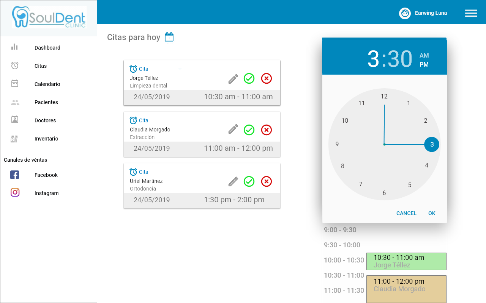

# UI Challenge Dashboard
Propuesta de diseño de un dashboard de administración de negocios para un freelance, en este caso para un dentista. El objetivo es proponer un diseño -fácil de entender- para tener control, visualizar datos o rastrear lo que sucede en el negocio.

## Sobre el reto
- Proceso de trabajo
- Cómo entiendes al usuario y cómo planteas soluciones a sus necesidades
- Cómo abordas los conceptos y los aterrizas en prototipos
- UX: Cómo manejas la lógica y los flujos durante toda la experiencia de uso
- UI: Cómo es tu estilo gráfico

## Entregables

Proceso de diseño, todas las herramientas que utilizaste durante el proyecto, así como la planeación que tuviste que llevar durante la semana.
Prototipo de alta fidelidad que muestre el producto.
KPI's
Presentación ejecutiva.
Recuerda hacer énfasis en los elementos que te llevaron a tomar decisiones de diseño, funcionalidad y lo que propone valor a tu propuesta.

## Freelance: Earwing Luna
La propuesta de dashboard está realizada para Earwing Luna, tiene 25 años, es cirujano dentista por parte de la Faculta de Estudios Superiores Zaragoza, de la UNAM. Earwing está en proceso de tramitar su cédula profesional, trabaja en un consultorio pero las condiciones laborales (horas de trabajo y salario) no son favorables, por lo que decidió tener su consultorio en su casa. 

Actualmente, Earwing da consulta los sábados y con base en la experiencia del consultorio donde aún trabaja él sabe cómo quiere trabajar y qué quiere implementar para cumplir sus objetivos en su consultorio SoulDent. En este sentido, el dashboard le sería una herramienta útil no sólo para visualizar sino también para organizar información tanto de pacientes, como del material y de los medicamentos.

Para conocer más sobre las necesidades, pains y gains de Earwing se realizó una entrevista en donde sobresalió lo siguiente:

**Pains**
* La doctora no respeta las citas agendadas, esto ocasiona que Earwing apresure las consultas y no brinda una atención adecuada al paciente.
* La doctora olvida las fechas en que Earwing no podrá asistir al consultorio, ya sea porque está en trámite de titulación o porque asistirá a algún congreso sobre odontología.
* No hay un control de inventario. La doctora busca no escatimar en gastos necesarios como el material desechable por obligación (guantes y cubrebocas) y eso es molesto para Earwing, pues menciona que ese material es indispensable y no tenerlo además de brindar mala imagen también puede generar desconfianza entre los pacientes.
* No se sabe de manera certera cuáles son los ingresos y los gastos de la clínica, sobre todo por el bajo salario que tienen los asistentes como Earwing.
* El salario es bajo y desproporcional a las horas de trabajo y pacientes atendidos.

**Gains**
* Usan un software para tener un control de pagos y facturas.
* Tiene un horario flexible, sí dejan faltar a Earwing para realizar los trámites escolares pendientes sin que le descuenten el día.

**Requerimientos**
1. Visualizar la cantidad de pacientes por día, semana, mes, año.
2. Visualizar los ingresos y gastos.
3. Visualizar las citas próximas, independientemente de la existencia de una agenda/calendario.
4. Visualizar los nuevos seguidores en Facebook e Instagram, redes donde empezará a difundir sus servicios para atraer nuevos clientes.
5. Visualizar el inventario (mostrar cantidad de medicamentos y materiales).

De lo anterior, cabe mencionar que el negocio de Earwing está en etapa de lanzamiento y posicionamiento; el objetivo principal es incrementar el número de pacientes en SoulDent. Por lo tanto, los KPI's para medir el cumplimiento del objetivo serían los siguientes:

* Comparar el número de informes/cotizaciones vs número de consultas sí concretadas.
* Comparar el número de citas agendadas vs el número de consultas realizadas.
* Utilizar Facebook Analyticis para saber qué tipo de publicación funciona mejor (orgánica o pagada), así como también saber en qué red se ganan más seguidores.
* A un mediano plazo, los usuarios pueden dejar su opinión haciendo que no sólo sea fácil medir el grado de satisfacción de los pacientes sino que también ayuda a consolidar la reputación y prestigio de los servicios brindados en SoulDent.

## Propuesta
La paleta de colores se conforma por tres elementos en CMYK:
* Azul: #0087BC
* Gris: #A6A6A6
* Blanco
Tipografía: 
* Ronded Elegance
* Roboto

Con base en lo anterior surge la propuesta para el logotipo del consultorio dental:

## Prototipo de alta fidelidad

Post its con las preguntas para conocer las necesidades del freelance.

Posteriormente, se diseñó en hoja y con lápiz la primera propuesta de dashboard.

En la primera iteración se llegó al diseño de alta fidelidad utilizando Adobe XD.
Pantalla de inicio

Pantalla de dashboard

La barra de navegación se despliega mostrando las opciones de configuración, ayuda y cerrar sesión.

La información sobre las citas agendadas.

La opción de agregar una cita, desplegando un modal para solicitar información de paciente y posteriormente desplegando el calendario y reloj para agendar la cita.

El calendario, ligado a Google Calendar, donde se visualizan los recordatorios, fechas importantes, citas, etc.

La información sobre los pacientes.

La información sobre un paciente en específico desplegando un modal.

Un modal para agregar pacientes.

La información sobre los odontólogos.

La información sobre los odontólogos.

La información sobre el inventario disponible en consultorio.

* La información de Facebook Analytics (en realidad, la idea es poner el link que lleve directamente a la sección de Facebook Analytics de la fanpage).

* La información de Instagram Analytics, así como la información de Facebook, la idea es poner un link directamente a la cuenta de dicha red social.

### Herramientas utilizadas
* Adobe XD
* Marvel
* Loom
* Google Drive: https://docs.google.com/document/d/1rHg4w-AV6MVTHs7nyBbF8LNWJWj7p3lnPIyQd-t2eBE/edit?usp=sharing

### Vídeo
En el siguiente link se muestra un vídeo en Loom mostrando el flujo de navegación de las distintas pantallas que conforman el Dashboard: https://www.loom.com/share/57a05de5a08548ee9126209b1adc88ff

