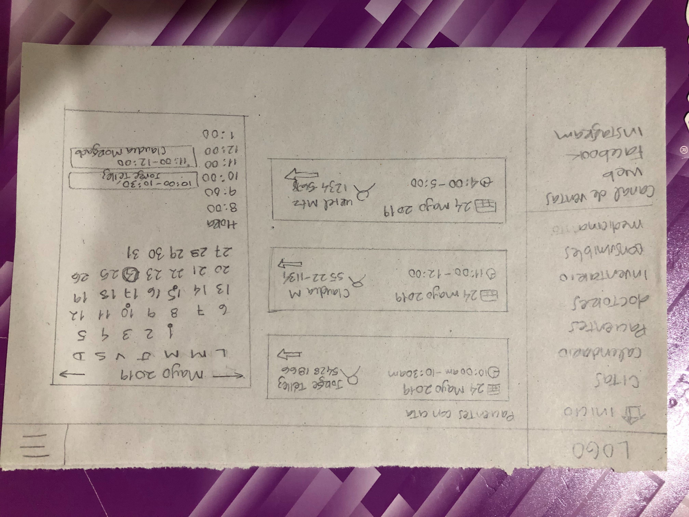
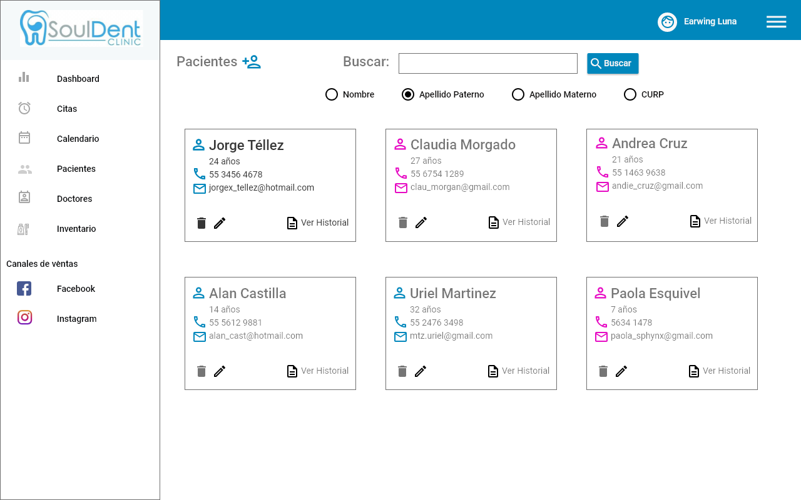
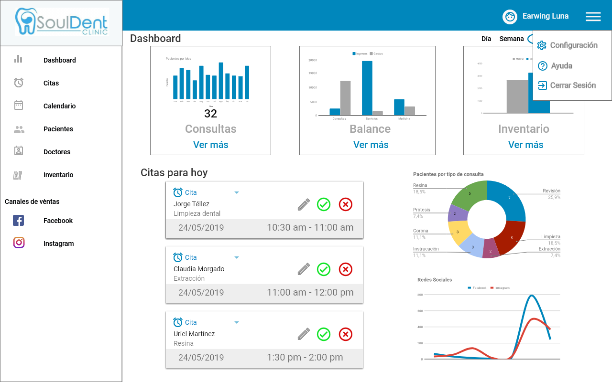
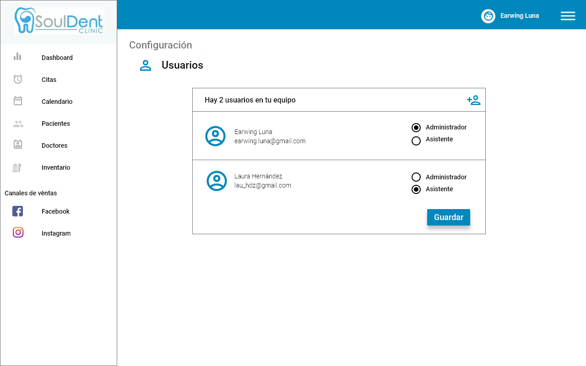
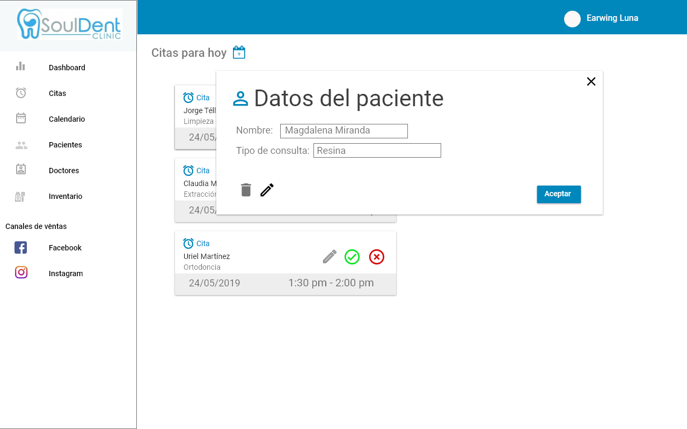

# UI Challenge Dashboard
Propuesta de diseño de un dashboard de administración de negocios para un freelance, em este caso para un dentista. El objetivo es proponer una manera para tener control, poder visualizar datos o para rastrear lo que sucede en el negocio.

## Sobre el reto
- Proceso de trabajo
- Cómo entiendes al usuario y cómo planteas soluciones a sus necesidades
- Cómo abordas los conceptos y los aterrizas en prototipos
- UX: Cómo manejas la lógica y los flujos durante toda la experiencia de uso
- UI: Cómo es tu estilo gráfico

## Entregables

Proceso de diseño, todas las herramientas que utilizaste durante el proyecto, así como la planeación que tuviste que llevar durante la semana.
Prototipo de alta fidelidad que muestre el producto.
KPI's
Presentación ejecutiva.
Recuerda hacer énfasis en los elementos que te llevaron a tomar decisiones de diseño, funcionalidad y lo que propone valor a tu propuesta.

## Propuesta
La paleta de colores se conforma por tres elementos en CMYK:
* Azul: #0087BC
* Gris: #A6A6A6
* Blanco
Tipografía: 
* Ronded Elegance
* Roboto

Con base en lo anterior surge la propuesta para el logotipo del consultorio dental:

## Prototipo de alta fidelidad

Post its con las preguntas para conocer las necesidades del freelance.

Posteriormente, se diseñó en hoja y con lápiz la primera propuesta de dashboard.

En la primera iteración se llegó al diseño de alta fidelidad utilizando Adobe XD.
Pantalla de dashboard

La barra de navegación se despliega mostrando las opciones de configuración, ayuda y cerrar sesión.

La información sobre las citas agendadas.

La opción de agregar una cita, desplegando un calendario y reloj.

El calendario, ligado a Google Calendar, donde se visualizan los recordatorios, fechas importantes, citas, etc.

La información sobre los pacientes.

La información sobre los pacientes.

La información sobre los odontólogos.

La información sobre los odontólogos.

La información sobre el inventario disponible en consultorio.

* La información de Facebook Analytics (en realidad, la idea es poner el link que lleve directamente a la sección de Facebook Analytics de la fanpage).

* La información de Instagram Analytics, así como la información de Facebook, la idea es poner un link directamente a la cuenta de dicha red social.

